# The Whiteboard Challenge

### *Challenge 01:*
- #### *Challenge A: Array Reversal*

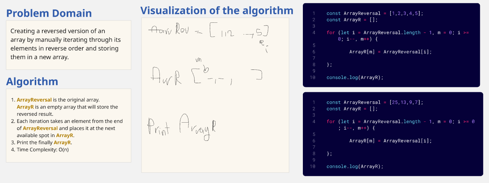

---

- #### *Challenge B: Most Frequent Number*

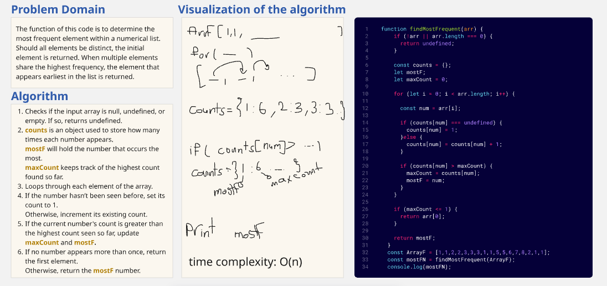

--- 

### *Challenge 02: Minimum Value*
- #### *Challenge : Minimum Value*
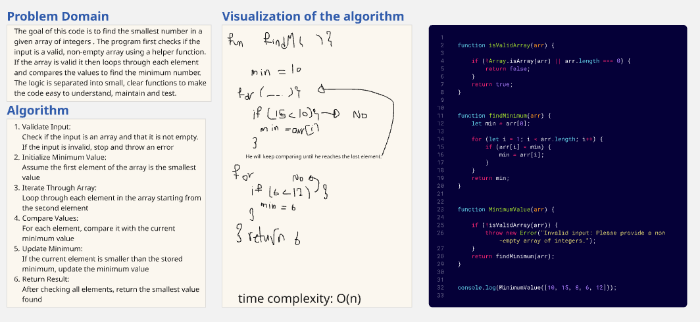

---

### *Challenge 03: Reverse-Characters*
- #### *Challenge : Reverse-Characters*
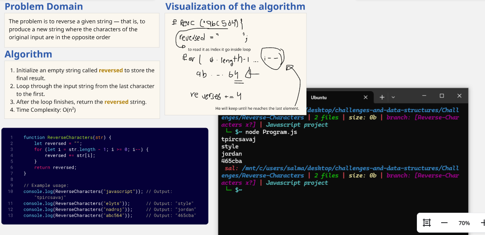
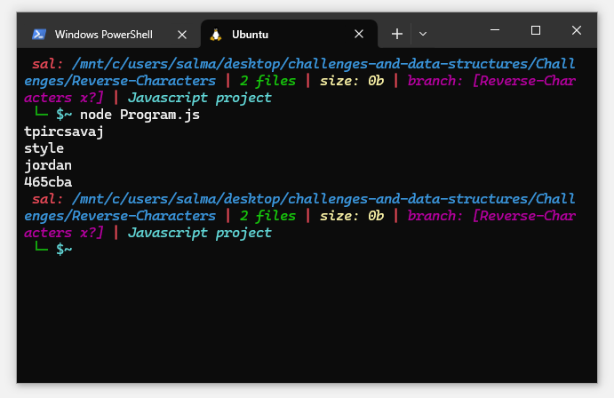

---

### *Challenge 04: Remove-Middle-Value*
- #### *Challenge : Remove-Middle-Value*
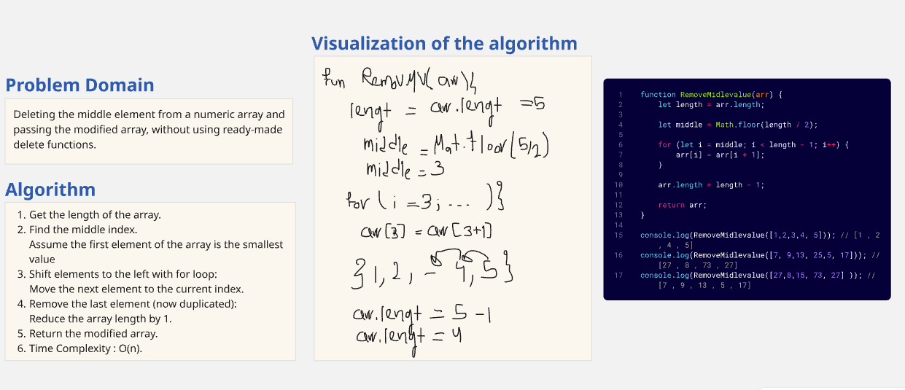

---

### *Challenge 05: Linked List*
- #### *Challenge : Linked List*
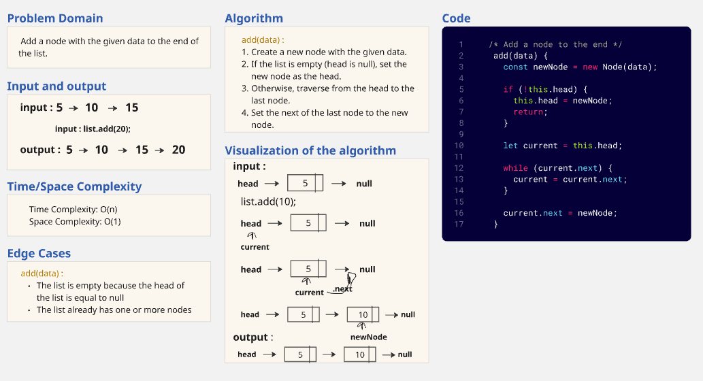
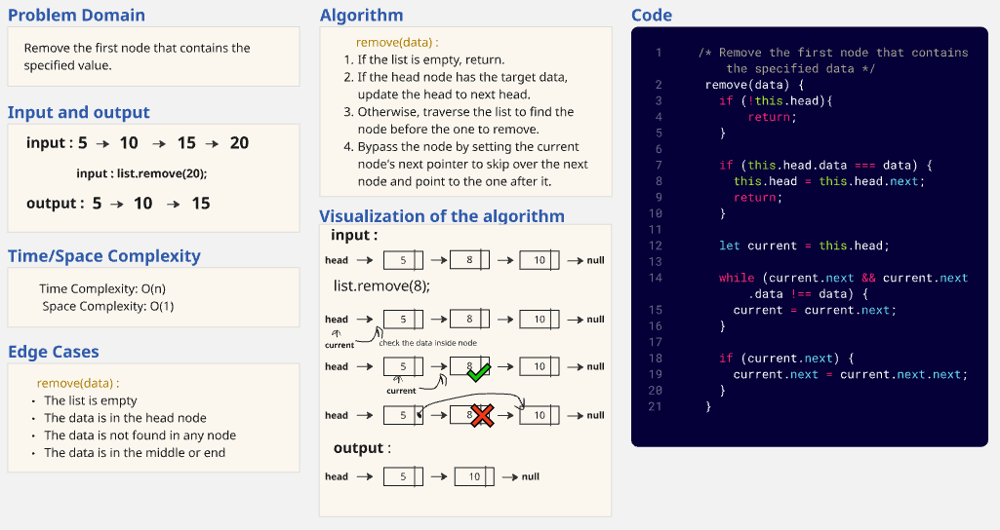
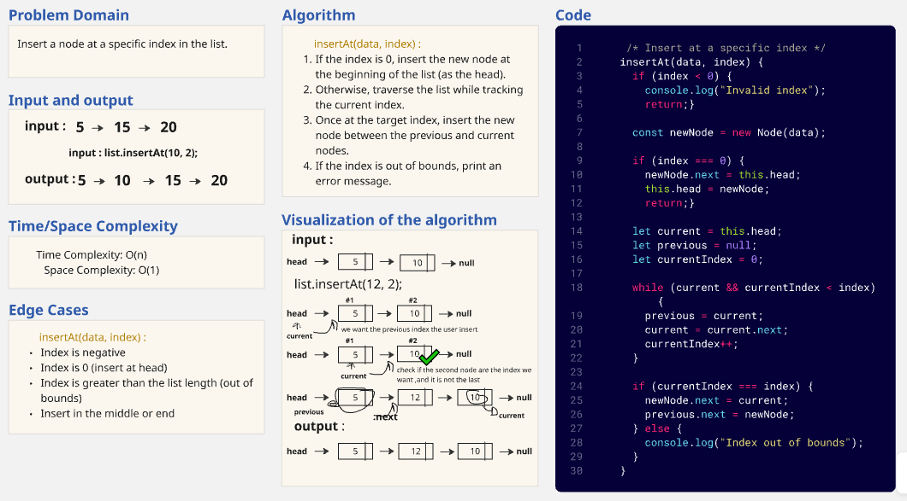
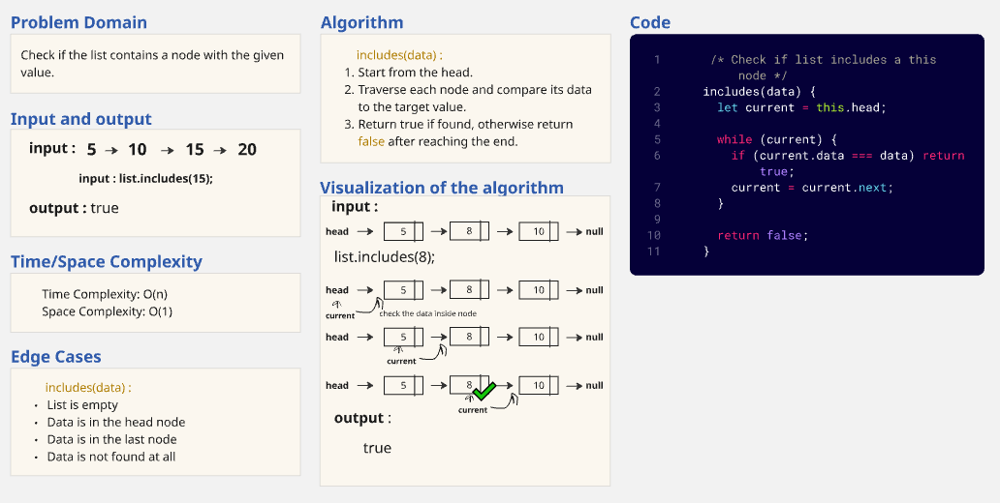
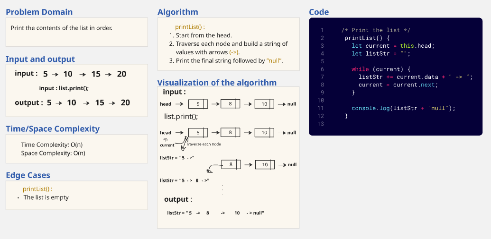

---

### *Challenge 06: Reverse Linked List*
- #### *Challenge : Reverse Linked List*
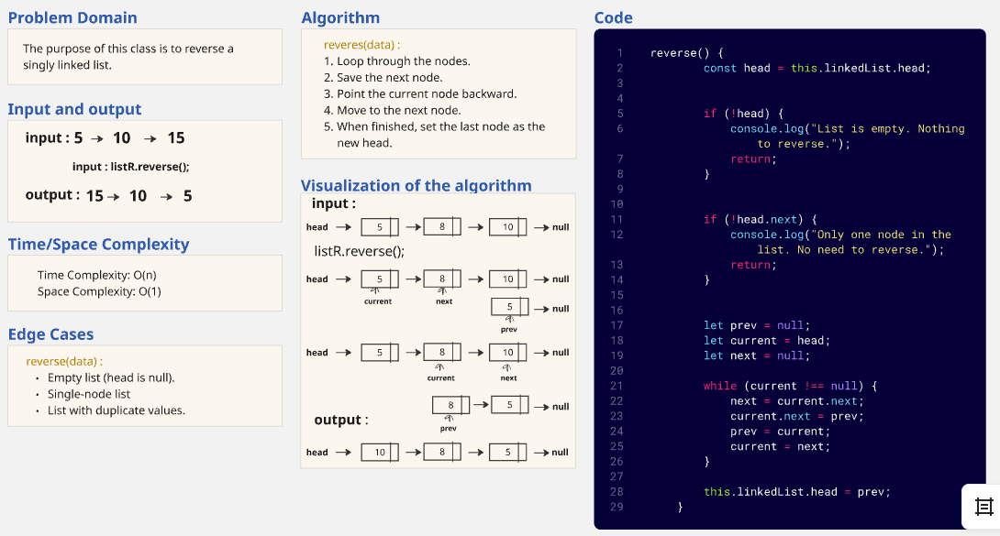

---

### *Challenge 07: Merge Sorted Linked List*
- #### *Challenge : Merge Sorted Linked List*
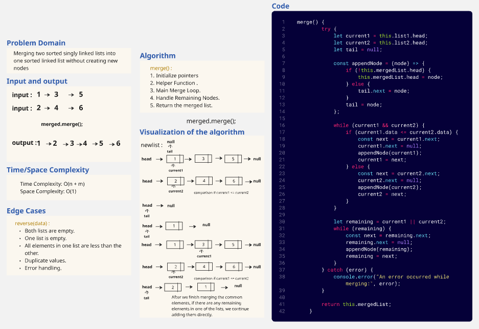

---

### *Challenge 08: Rotate Linked List*
- #### *Challenge : Rotate Linked List*
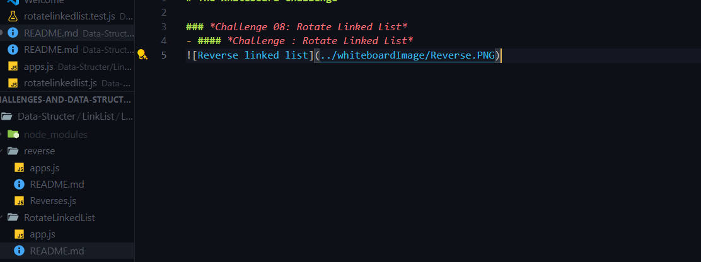